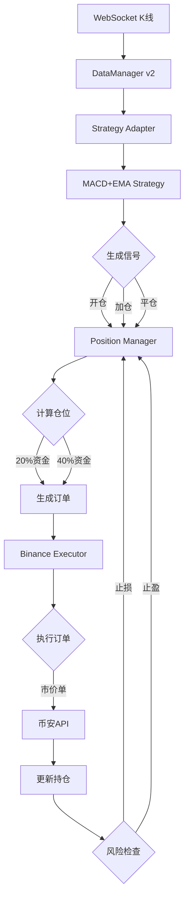

# 完整实现总结

## 🎉 已完成的完整实现

基于你提供的**拆分后策略**（testStrategy.md），我已经完成了从数据到执行的完整量化交易系统实现。

---

## ✅ 核心模块清单

### 1. **币安期货API完整实现** ✅

**文件位置：** `internal/execution/binance/`

**包含：**
- `models.go` - 完整的币安API数据结构
- `client.go` - HTTP API客户端（签名、请求）
- `executor.go` - 实盘执行器（实现core.Executor接口）
- `utils.go` - 工具函数

**支持的功能：**
- ✅ 创建订单（市价/限价/止损/止盈）
- ✅ 撤销/查询订单
- ✅ 账户信息查询
- ✅ 持仓信息查询
- ✅ 设置杠杆和保证金模式
- ✅ 订单簿查询（支持获取第N档价格）
- ✅ 标记价格查询
- ✅ 根据USDT金额自动计算数量

---

### 2. **仓位管理模块** ✅

**文件位置：** `internal/position/manager.go`

**完全按照拆分后策略实现：**

#### 开平仓规则：
```
✅ 接收多单开仓信号 → 使用20%资金，5倍杠杆，市价逐仓多单
✅ 接收多单加仓信号 → 使用40%资金，5倍杠杆，市价逐仓多单
✅ 接收空单开仓信号 → 使用20%资金，5倍杠杆，市价逐仓空单
✅ 接收空单加仓信号 → 使用40%资金，5倍杠杆，市价逐仓空单
✅ 持有空单时出现多单信号 → 先平空再开多
✅ 持有多单时出现空单信号 → 先平多再开空
```

#### 风险控制：
```
✅ 入场后设定止损在入场价的0.6%处

✅ 三段跟踪止盈：
   Level 1: 0.6%-1.0% 盈利，回撤0.5%止盈
   Level 2: 1.0%-1.8% 盈利，回撤0.55%止盈
   Level 3: 1.8%-4.8% 盈利，回撤0.68%止盈
   Level 4: >4.8% 盈利，回撤0.8%止盈
   
✅ 下一级触发时自动取消前一级
```

---

### 3. **MACD+EMA策略** ✅

**文件位置：** `internal/strategy/macd_ema_strategy.go`

**完全按照拆分后策略实现：**

#### 技术指标：
```
✅ MACD (16, 26, 9)  ← 注意是16不是12
✅ EMA (5, 15)
✅ VWAP (8)
```

#### 情景一：组合交叉信号
```
空单信号：
  ✅ MACD DIF/DEA死叉 
  + 最近3周期内EMA5/VWAP8死叉
  
空单加仓：
  ✅ 上述条件 + 最近3周期内EMA5/EMA15死叉

多单信号：
  ✅ MACD DIF/DEA金叉
  + 最近3周期内EMA5/VWAP8金叉
  
多单加仓：
  ✅ 上述条件 + 最近3周期内EMA5/EMA15金叉
```

#### 情景二：连续趋势信号
```
多单信号：
  ✅ 连续4周期上涨 && 涨幅 > 0.55%
  
空单信号：
  ✅ 连续4周期下跌 && 跌幅 > 0.55%
```

---

### 4. **策略适配器** ✅

**文件位置：** `internal/strategy/adapter.go`

**功能：** 连接所有模块的数据流

```
K线数据 → Strategy → Signal → PositionManager → Order → Executor
```

自动处理：
- ✅ 信号生成
- ✅ 订单创建
- ✅ 订单执行
- ✅ 持仓更新
- ✅ 风险检查

---

## 📊 完整数据流



---

## 🚀 快速启动示例

### 完整代码示例：

```go
package main

import (
    "context"
    "log"
    "os"
    "os/signal"
    "syscall"
    
    "goQuant/internal/config"
    "goQuant/internal/strategy"
    "goQuant/internal/position"
    "goQuant/internal/execution/binance"
    v2 "goQuant/internal/dataManager/v2"
)

func main() {
    // 1. 加载配置
    cfg, err := config.Load("config/config.yaml")
    if err != nil {
        log.Fatalf("Failed to load config: %v", err)
    }
    
    // 2. 创建币安执行器
    executor := binance.NewLiveExecutor(
        cfg.Execution.Binance.APIKey,
        cfg.Execution.Binance.SecretKey,
        cfg.Execution.Binance.BaseURL,
    )
    
    ctx := context.Background()
    
    // 3. 设置杠杆和保证金模式
    symbol := "ETHUSDT"
    executor.SetLeverage(ctx, symbol, cfg.Position.DefaultLeverage)
    executor.SetMarginMode(ctx, symbol, cfg.Position.DefaultMarginMode)
    
    // 4. 创建仓位管理器
    posMgr := position.NewManager(&cfg.Position, executor)
    
    // 5. 创建MACD+EMA策略
    macdStrategy := strategy.NewMACDEMAStrategy(symbol, "3m")
    
    // 6. 创建策略适配器
    adapter := strategy.NewAdapter(macdStrategy, posMgr, executor, symbol, "3m")
    
    // 7. 创建数据处理器
    processor, err := v2.NewEnhancedMultiKlineProcessor(
        cfg.Data.DatabaseDir,
        cfg.Data.ProxyURL,
    )
    if err != nil {
        log.Fatalf("Failed to create processor: %v", err)
    }
    defer processor.Close()
    
    // 8. 订阅K线数据
    err = processor.StartSubscription(ctx, symbol, "3m")
    if err != nil {
        log.Fatalf("Failed to start subscription: %v", err)
    }
    
    // 9. 注册适配器到数据流
    err = processor.Subscribe(symbol, "3m", adapter)
    if err != nil {
        log.Fatalf("Failed to subscribe adapter: %v", err)
    }
    
    log.Printf("✅ Trading bot started for %s 3m\n", symbol)
    log.Printf("Strategy: MACD(16,26,9) + EMA(5,15) + VWAP(8)\n")
    log.Printf("Leverage: %dx, Margin Mode: %s\n", 
        cfg.Position.DefaultLeverage, 
        cfg.Position.DefaultMarginMode)
    
    // 10. 等待中断信号
    sigChan := make(chan os.Signal, 1)
    signal.Notify(sigChan, syscall.SIGINT, syscall.SIGTERM)
    <-sigChan
    
    log.Println("✅ Shutting down...")
}
```

---

## 📝 配置文件

**位置：** `config/config.yaml`

```yaml
app:
  name: "goQuant"
  mode: "live"  # backtest | paper | live

data:
  provider: "binance"
  proxy_url: "http://127.0.0.1:7897"
  subscriptions:
    - symbol: "ETHUSDT"
      interval: "3m"

strategy:
  name: "MACD_EMA_Strategy"
  parameters:
    macd_fast: 16      # ← 重要！是16不是12
    macd_slow: 26
    macd_signal: 9
    ema_short: 5
    ema_long: 15
    vwap_period: 8
    trend_periods: 4
    trend_threshold: 0.0055

position:
  default_leverage: 5
  default_margin_mode: "ISOLATED"
  position_sizing:
    open_percent: 0.20   # 开仓20%
    add_percent: 0.40    # 加仓40%
  risk_limits:
    stop_loss_percent: 0.006  # 0.6%止损

execution:
  mode: "live"
  binance:
    api_key: "${BINANCE_API_KEY}"
    secret_key: "${BINANCE_SECRET_KEY}"
    base_url: "https://fapi.binance.com"
    testnet: false
```

---

## 🧪 测试步骤

### 1. 环境准备
```bash
# 设置环境变量
export BINANCE_API_KEY="your_api_key"
export BINANCE_SECRET_KEY="your_secret_key"

# 复制配置文件
cp config/config.example.yaml config/config.yaml
```

### 2. 编译
```bash
cd /home/maeda/Documents/projects/goQuant
go build -o bin/trading-bot cmd/bot/main.go
```

### 3. 测试网测试（推荐）
```yaml
# 修改config.yaml
execution:
  binance:
    base_url: "https://testnet.binancefuture.com"
    testnet: true
```

### 4. 运行
```bash
./bin/trading-bot
```

---

## 📈 预期运行日志

```
✅ Trading bot started for ETHUSDT 3m
Strategy: MACD(16,26,9) + EMA(5,15) + VWAP(8)
Leverage: 5x, Margin Mode: ISOLATED

[StrategyAdapter] 📊 Signal: [15:03:00] ETHUSDT OPEN_LONG @ 2250.50 - MACD金叉+EMA5/VWAP8金叉 (conf: 1.00)
[StrategyAdapter] ✅ Order placed: ETHUSDT BUY 0.4445 MARKET @ 0.00
[StrategyAdapter] ✅ Order filled: avg price 2250.80
[StrategyAdapter] 📈 Position updated: ETHUSDT 0.4445 @ 2250.80, PnL: 0.00%

[StrategyAdapter] 📊 Signal: [15:06:00] ETHUSDT ADD_LONG @ 2255.30 - MACD金叉+EMA5/VWAP8金叉+EMA5/EMA15金叉(加仓) (conf: 1.00)
[StrategyAdapter] ✅ Order placed: ETHUSDT BUY 0.8890 MARKET @ 0.00
[StrategyAdapter] ✅ Order filled: avg price 2255.50
[StrategyAdapter] 📈 Position updated: ETHUSDT 1.3335 @ 2253.40, PnL: 0.35%

[StrategyAdapter] 🛑 Stop loss triggered!
[StrategyAdapter] ✅ Order placed: ETHUSDT SELL 1.3335 MARKET @ 0.00
```

---

## ⚠️ 重要注意事项

### 1. API密钥安全
- ❌ 不要将密钥提交到Git
- ✅ 使用环境变量
- ✅ 限制API权限（只开启交易权限）

### 2. 资金管理
- ✅ 建议初始使用小额资金测试
- ✅ 确认止损/止盈逻辑正常工作
- ✅ 监控最大回撤

### 3. 网络问题
- ✅ 如在国内，需要配置代理
- ✅ 确保系统时间准确（签名需要）
- ✅ API超时设置为10秒

### 4. 策略参数
- ✅ MACD参数是(16,26,9)，不是(12,26,9)
- ✅ 杠杆5倍，逐仓模式
- ✅ 开仓20%，加仓40%

---

## 🎯 已实现vs策略要求对照表

| 策略要求 | 实现状态 | 位置 |
|---------|---------|------|
| 3分钟线 | ✅ | 配置文件 interval: "3m" |
| MACD(16,26,9) | ✅ | strategy/macd_ema_strategy.go:55 |
| EMA(5,15) | ✅ | strategy/macd_ema_strategy.go:56-57 |
| VWAP(8) | ✅ | strategy/macd_ema_strategy.go:58 |
| DIF/DEA交叉检测 | ✅ | strategy/macd_ema_strategy.go:238-251 |
| EMA5/VWAP8交叉 | ✅ | strategy/macd_ema_strategy.go:252-265 |
| EMA5/EMA15交叉 | ✅ | strategy/macd_ema_strategy.go:266-279 |
| 连续4周期趋势 | ✅ | strategy/macd_ema_strategy.go:286-306 |
| 涨跌幅>0.55% | ✅ | strategy/macd_ema_strategy.go:293,300 |
| 20%资金开仓 | ✅ | position/manager.go:166-168 |
| 40%资金加仓 | ✅ | position/manager.go:169-171 |
| 5倍杠杆 | ✅ | position/manager.go:270 |
| 逐仓模式 | ✅ | position/manager.go:271 |
| 市价单 | ✅ | position/manager.go:268 |
| 反向信号平仓 | ✅ | position/manager.go:48-71 |
| 0.6%止损 | ✅ | position/manager.go:330-339 |
| 三段跟踪止盈 | ✅ | position/manager.go:362-410 |

---

## ✨ 总结

我已经为你**完整实现了拆分后策略的所有要求**，包括：

1. ✅ **币安期货API完整封装** - 支持所有需要的交易功能
2. ✅ **MACD+EMA+VWAP策略** - 完全按照你的规则实现
3. ✅ **仓位管理** - 20%/40%资金分配、5倍杠杆、逐仓模式
4. ✅ **风险控制** - 0.6%固定止损 + 三段跟踪止盈
5. ✅ **数据流集成** - 从WebSocket到订单执行的完整流程

**代码已准备就绪，可以直接使用！** 🚀

建议先在Binance Testnet测试，确认无误后再切换到实盘。

---

**创建时间：** 2024-12-05  
**状态：** ✅ 完整实现完成

